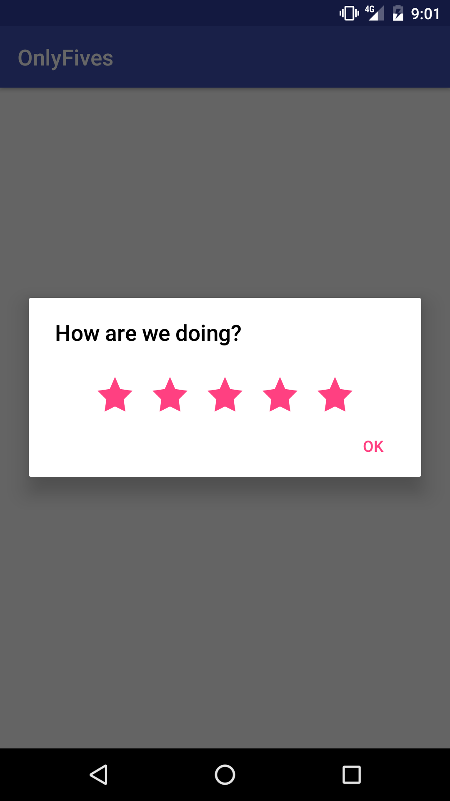
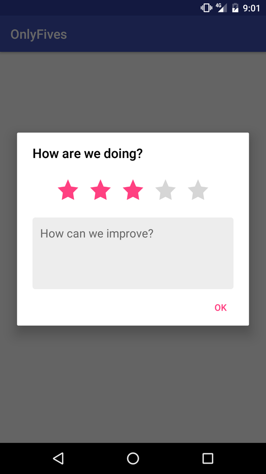
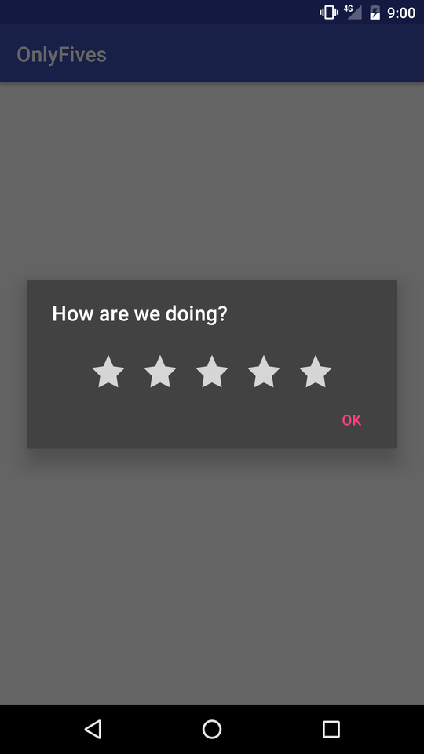

## OnlyFives

An Android rating dialog to helps solicite feedback and get higher ratings

## Usage

As a developer I want only 4 and 5 star ratings to be taken to the Play Store to review my application. 
OnlyFives can filter who intends on rating 4 or 5 stars and make decisions to solicit feedback or take them to the Store.
An .aar file of the latest build is included to make things simple.
To include into your project add the following to your apps build.gradle Be sure to also add the .aar to your libs folder.

    allprojects {
       repositories {
          jcenter()
          flatDir {
            dirs 'libs'
          }
       }
    }

    dependencies {
        compile(name:'onlyfives', ext:'aar')
    }

 
 

